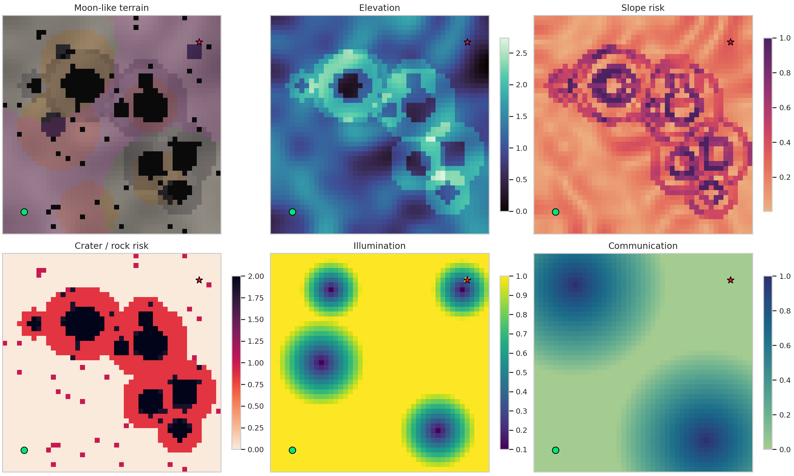
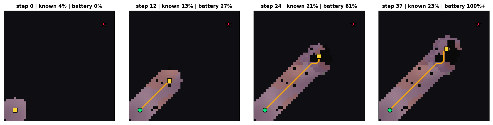
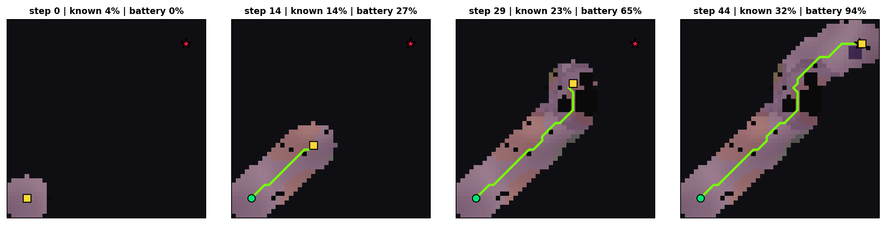
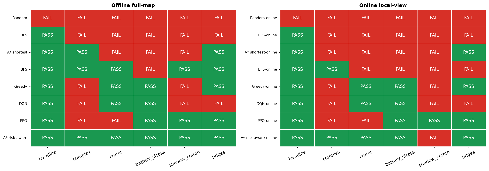
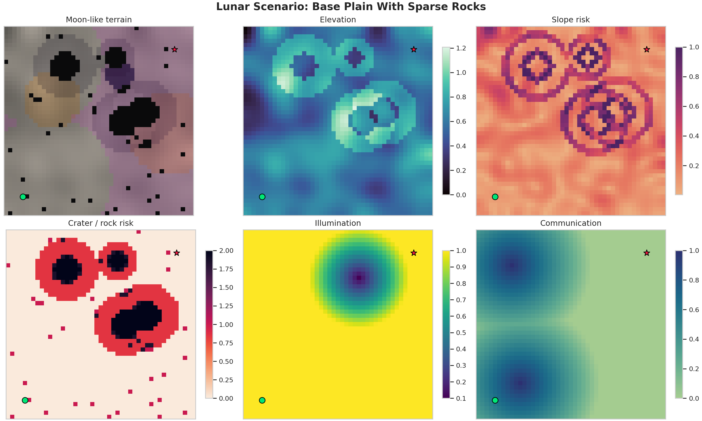
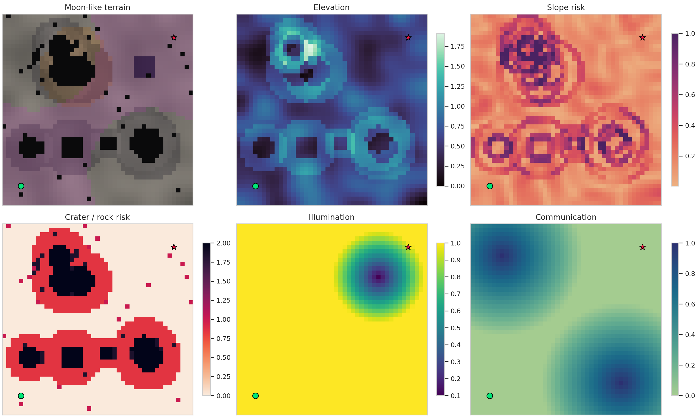
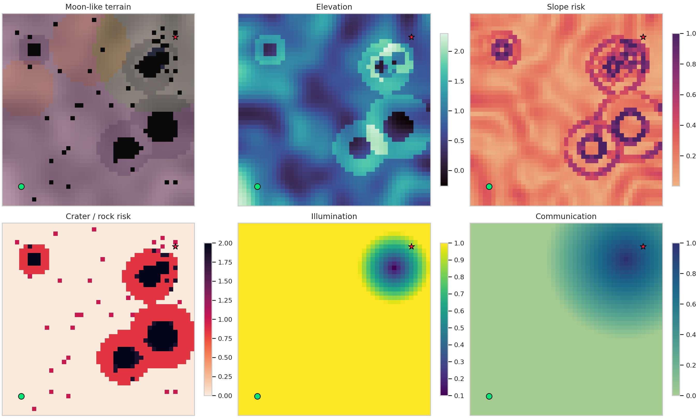
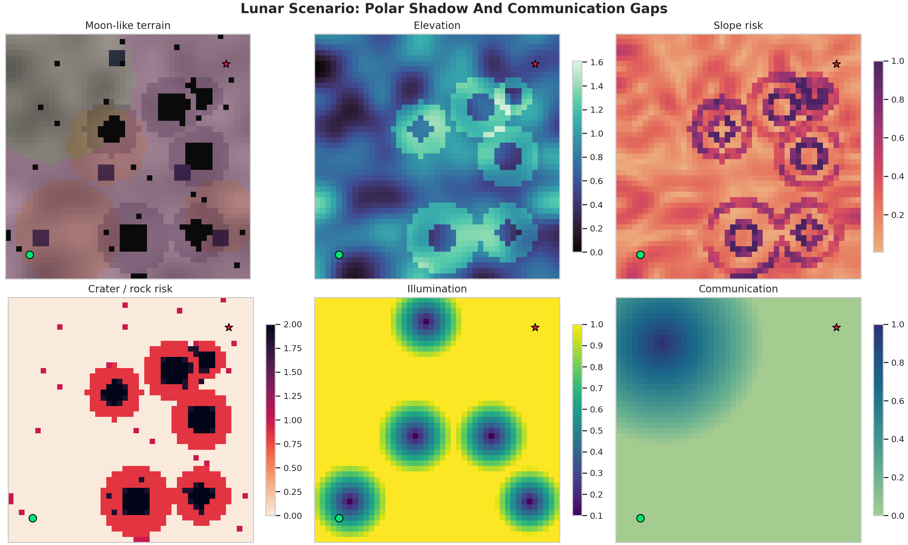
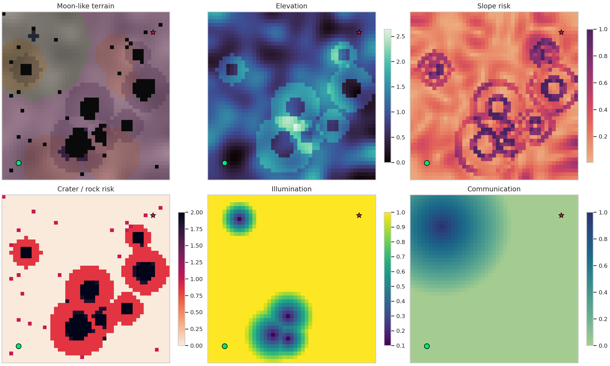

# Energy-Aware Path Planning for Lunar Industrial Rovers under Terrain Risk and Local Sensing Constraints

## Abstract

This report examines energy-constrained path planning for a lunar industrial rover operating on DEM-like moon terrain. The simulator models elevation, slope, crater hazards, rocks, soft regolith, illumination, communication coverage, and finite battery capacity. The study compares uninformed search, heuristic planning, risk-aware graph search, and reinforcement learning under both offline full-map and online local-view assumptions. The results suggest that lunar rover navigation is not well represented by a pure shortest-path formulation: methods that account for terrain-dependent energy and mission risk are more likely to find feasible routes when battery margins are tight.

**Keywords:** lunar rover, path planning, energy constraint, risk-aware A*, reinforcement learning, local sensing

## 1. Introduction

Future lunar industrial activity would likely require mobile robots to transport equipment, resources, and samples across unstructured terrain. Unlike terrestrial road navigation, lunar surface mobility is affected by craters, rocks, steep slopes, soft regolith, poor illumination, communication gaps, and strict battery limits. A collision-free geometric route may still be infeasible if it traverses high-slope or shadowed regions and exhausts the rover battery before reaching the target.

This paper evaluates path-planning algorithms for an energy-limited lunar rover. The comparison includes simple baselines, classical graph search, risk-aware planning, local-view replanning, and reinforcement learning. The guiding question is whether explicitly modeling terrain-dependent energy and mission risk improves route feasibility compared with distance-only or locally greedy planning.

To make the comparison concrete, this report uses: (i) a moon-like grid simulator with multiple terrain layers and finite-battery execution, (ii) a consistent comparison of several planning families, including A*, DQN, PPO, BFS, DFS, Greedy, and Random, (iii) offline and online experiments under shared evaluation rules, and (iv) a scale-up evaluation over multiple randomized maps.

## 2. Problem Formulation

The rover operates on a `45 x 45` grid. A task is defined by a start cell `s_start`, a goal cell `s_goal`, and a scenario-specific battery capacity `B`. The action set contains eight moves: four cardinal moves and four diagonal moves. Cardinal moves have distance `1`, while diagonal moves have distance `sqrt(2)`.

Each cell `j` contains terrain attributes:

| Symbol | Layer | Meaning |
|---|---|---|
| `h_j` | elevation | DEM-like terrain height |
| `S_j` | slope | normalized local slope |
| `O_j` | obstacle | rock or crater core, impassable when true |
| `C_j` | crater risk | crater-rim hazard level |
| `R_j` | regolith | soft-soil traction penalty |
| `L_j` | illumination | sunlight availability |
| `Q_j` | communication | communication quality |

For a transition from cell `i` to cell `j`, let `d_ij` be the move distance and let the uphill elevation gain be:

$$\Delta h^+_{ij}=\max(0, h_j-h_i).$$

The transition energy is parameterized as:

$$E_{ij}=d_{ij}\left(1+\alpha_s S_j+\alpha_r R_j+\alpha_h \Delta h^+_{ij}+\alpha_l(1-L_j)\right).$$

The risk-aware transition cost used by A* risk-aware, online risk-aware replanning, evaluation, and as a one-step terrain term in the Greedy baseline is:

$$J_{ij}=E_{ij}+\beta_c C_j+\beta_s S_j+\beta_q(1-Q_j).$$

The coefficients used in the experiments are:

| Parameter | Value | Meaning |
|---|---:|---|
| `alpha_s` | 2.2 | slope multiplier in energy |
| `alpha_r` | 1.7 | regolith multiplier in energy |
| `alpha_h` | 1.1 | uphill elevation multiplier in energy |
| `alpha_l` | 0.8 | low-illumination multiplier in energy |
| `beta_c` | 2.2 | crater-risk cost weight |
| `beta_s` | 1.0 | slope-risk cost weight |
| `beta_q` | 1.3 | communication-risk cost weight |

These coefficients are heuristic simulation parameters rather than physically calibrated rover constants. Since the terrain layers are normalized, the values specify the relative importance of slope, regolith, uphill motion, low illumination, crater risk, and communication loss in the synthetic lunar environment. They were selected through pilot runs to create non-trivial scenarios where simple shortest-path methods, local heuristics, reinforcement learning policies, and risk-aware planners can show distinguishable behavior under the same per-scenario battery constraint.

The accumulated route energy for a path `P=(s_0,...,s_T)` is:

$$E(P)=\sum_{t=0}^{T-1}E_{s_t,s_{t+1}}.$$

A route succeeds only if:

$$s_T=s_{goal}\quad\text{and}\quad E(P)\le B.$$

If cumulative energy exceeds `B` during execution, the rover immediately fails and the recorded trajectory stops. This rule is applied to all methods, including Random and reinforcement learning.

The simulator also stores an auxiliary cell cost as a compact cell-level terrain descriptor:

$$M_j=1+\lambda_s S_j+\lambda_c C_j+\lambda_r R_j+\lambda_l(1-L_j)+\lambda_q(1-Q_j),$$

with `lambda_s=2.8`, `lambda_c=2.2`, `lambda_r=1.7`, `lambda_l=1.6`, and `lambda_q=1.3`. Obstacle cells have infinite cost.

The `lambda` coefficients are also heuristic parameters. Unlike the `alpha` and `beta` values, they define a static cell-level terrain descriptor rather than the transition energy used for battery depletion.

Two map-information assumptions are evaluated. The offline setting uses a fully known DEM and terrain layers before planning. The online setting reveals a local sensing window around the rover and replans as new cells become known. This online setting models incremental map revelation, not full SLAM; localization uncertainty, sensor noise, loop closure, and map optimization are not included.

## 3. Methodology

The compared methods are grouped as follows:

| Method | Group | Core idea |
|---|---|---|
| Random | Baseline | Samples feasible local moves |
| DFS | Search | Depth-first graph traversal |
| BFS | Search | Minimizes step count |
| Greedy | Heuristic | Chooses the lowest one-step goal-cost score |
| A* shortest | Search | Minimizes geometric distance |
| A* risk-aware | Search | Minimizes `J_ij` with battery pruning |
| DQN | RL | Learns an action-value policy |
| PPO | RL | Learns a stochastic policy |

The simpler baselines mainly differ in how much future terrain information they use. Random, DFS, BFS, and A* shortest do not optimize the full energy-risk objective. Greedy uses a local one-step score, while A* risk-aware explicitly uses the terrain-aware cost.

For DQN and PPO, a single generalized model is trained for each algorithm by sampling maps from all six scenario families during training. The observation contains the rover state, goal direction, local terrain attributes, local action feasibility/cost features, distance-to-goal, and remaining battery. The reward combines terrain-aware transition cost, distance shaping, goal reward, and battery-failure penalty:

$$r_t=-J_{s_t,s_{t+1}}+\eta\left(\gamma\Phi(s_{t+1})-\Phi(s_t)\right)+r_{goal}\mathbf{1}_{goal}-r_{bat}\mathbf{1}_{battery},$$

where `Phi(s)=-dist(s,s_goal)`, `eta=4.0`, `gamma=0.94`, `r_goal=300`, and `r_bat=180`. Invalid actions receive an additional penalty, and the generalized DQN/PPO weights are saved under `experiments/results/models/`.

Fairness is maintained by using the same map, start-goal pair, battery budget, transition energy, and success/failure evaluator for all methods. RL methods do not receive a relaxed battery rule at test time.

## 4. Experiments

### 4.1 Experimental Setup

The experiments use six `45 x 45` lunar scenario families with eight-neighbor motion and finite battery execution. Battery budgets are scenario-specific pilot-run settings chosen to avoid trivial all-pass or all-fail outcomes; they should be read relative to each terrain family rather than as a global ranking of battery availability.

| family             | main stress                          | B   |
| ------------------ | ------------------------------------ | --- |
| Base plain         | Sparse rocks                         | 90  |
| Crater field       | Dense craters                        | 90  |
| Highland ridges    | Slope and elevation                  | 92  |
| Polar shadow       | Low light and weak communication     | 118 |
| Integrated terrain | Mixed craters, rocks, slopes, shadow | 108 |
| Battery stress     | Tight energy margin                  | 112 |

Figure A shows one representative environment. It includes the rendered terrain, elevation, slope/crater risk, illumination, and communication layers; the remaining environment maps are kept in the Appendix.

**Figure A. Representative lunar environment layers for `complex_moon`.**

### 4.2 Case-Level Offline and Online Results

The case-level results are used as qualitative diagnostics under fixed maps, start-goal pairs, per-scenario battery budgets, and success criteria. Broader quantitative evidence is reported in the scale-up experiment.

Figure 1 first shows the offline full-map paths on the Integrated Lunar Industrial Terrain scenario. This view makes the route differences between shortest-path, risk-aware, search-based, and learning-based methods easier to inspect before introducing partial map information.

**Figure 1. Offline Integrated Lunar Industrial Terrain path examples. Failed trajectories are marked with an `X`.**

The online setting then relaxes the full-map assumption. The rover starts with an unknown map and reveals only a circular local sensing window around its current position. Unknown cells are treated as traversable with neutral terrain estimates until observed. Methods replan using the currently known map. This is online replanning under incremental map revelation rather than SLAM, because rover localization is assumed known and no sensor-noise or map-optimization model is included.

Figures 2a and 2b show two online local-view rollouts on the same Integrated Lunar Industrial Terrain scenario. Greedy online search fails after exhausting the battery while still far from the goal, whereas risk-aware online planning reaches the goal with remaining energy.

Additional path visualizations and battery margins are moved to the Appendix to keep the main text focused.

**Figure 2a. Online local-view failure case on Integrated Lunar Industrial Terrain using Greedy online search. Dark cells are unknown, revealed cells are inside accumulated sensing windows, and the yellow square marks the current rover position.**

**Figure 2b. Online local-view success case on the same Integrated Lunar Industrial Terrain scenario using risk-aware online planning.**

Figure 3 summarizes the pass/fail outcome across all representative case-level maps under both information assumptions.

**Figure 3. Offline full-map and online local-view pass/fail outcomes.**

### 4.3 Scale-Up Experiment

The case-level experiments are extended by generating multiple random maps for each scenario family. This provides a broader estimate of performance than a small number of representative maps and also covers the cross-map behavior of the saved RL policies. The scale-up experiment evaluates the same eight methods used in the main comparison: Random, DFS, BFS, Greedy, A* shortest, A* risk-aware, DQN, and PPO.

This scale-up experiment uses `6` scenario families and `30` random maps per scenario family for each setting. Across the offline and online settings, this corresponds to `360` generated map-setting pairs and `2880` method evaluations.

Tables 1 and 2 report pass rates for each scenario family, with the final column giving the average over all six families. Table 3 adds the corresponding overall mean energy consumption and path length.

For DQN and PPO, the online evaluation uses the same compact local observation as training; because this observation already contains the current cell, neighboring action costs, goal direction, and battery level, incremental map revelation does not remove additional long-range map information from these policies. The offline-online contrast is therefore most visible for explicit planners that rely on a multi-step map search.

**Table 1. Offline full-map scale-up pass rate by method and scenario family.**

| method        | baseline | complex | crater | battery_stress | shadow_comm | ridges | overall |
| ------------- | -------- | ------- | ------ | -------------- | ----------- | ------ | ------- |
| Random        | 0.0      | 0.0     | 0.0    | 0.0            | 0.0         | 0.0    | 0.0     |
| PPO           | 0.4      | 0.33    | 0.17   | 0.2            | 0.43        | 0.17   | 0.28    |
| DQN           | 0.4      | 0.2     | 0.13   | 0.37           | 0.67        | 0.27   | 0.34    |
| BFS           | 0.3      | 0.33    | 0.1    | 0.43           | 0.67        | 0.23   | 0.34    |
| A* shortest   | 0.33     | 0.3     | 0.13   | 0.4            | 0.63        | 0.3    | 0.35    |
| DFS           | 0.37     | 0.27    | 0.17   | 0.37           | 0.67        | 0.27   | 0.35    |
| Greedy        | 0.43     | 0.27    | 0.17   | 0.57           | 0.77        | 0.4    | 0.43    |
| A* risk-aware | 0.83     | 0.93    | 0.53   | 0.93           | 1.0         | 0.87   | 0.85    |

**Table 2. Online local-view scale-up pass rate by method and scenario family.**

| method        | baseline | complex | crater | battery_stress | shadow_comm | ridges | overall |
| ------------- | -------- | ------- | ------ | -------------- | ----------- | ------ | ------- |
| Random        | 0.0      | 0.0     | 0.0    | 0.0            | 0.07        | 0.03   | 0.02    |
| PPO           | 0.4      | 0.33    | 0.17   | 0.2            | 0.43        | 0.17   | 0.28    |
| BFS           | 0.27     | 0.17    | 0.1    | 0.33           | 0.6         | 0.27   | 0.29    |
| DFS           | 0.37     | 0.23    | 0.13   | 0.37           | 0.6         | 0.27   | 0.33    |
| DQN           | 0.4      | 0.2     | 0.13   | 0.37           | 0.67        | 0.27   | 0.34    |
| A* shortest   | 0.37     | 0.3     | 0.13   | 0.37           | 0.67        | 0.27   | 0.35    |
| Greedy        | 0.37     | 0.27    | 0.17   | 0.5            | 0.73        | 0.4    | 0.41    |
| A* risk-aware | 0.4      | 0.47    | 0.23   | 0.67           | 0.87        | 0.47   | 0.52    |

**Table 3. Overall scale-up pass rate, mean energy, and mean path length.**

| method        | offline_pass | offline_energy | offline_length | online_pass | online_energy | online_length |
| ------------- | ------------ | -------------- | -------------- | ----------- | ------------- | ------------- |
| Random        | 0.0          | 103.18         | 58.27          | 0.02        | 103.08        | 48.9          |
| PPO           | 0.28         | 97.67          | 53.36          | 0.28        | 97.67         | 53.36         |
| BFS           | 0.34         | 99.06          | 47.2           | 0.29        | 99.64         | 46.99         |
| DFS           | 0.35         | 99.17          | 46.71          | 0.33        | 99.36         | 46.46         |
| DQN           | 0.34         | 96.35          | 52.29          | 0.34        | 96.35         | 52.29         |
| A* shortest   | 0.35         | 99.11          | 47.19          | 0.35        | 99.17         | 46.78         |
| Greedy        | 0.43         | 97.12          | 50.37          | 0.41        | 97.62         | 50.37         |
| A* risk-aware | 0.85         | 88.26          | 58.45          | 0.52        | 79.43         | 42.74         |

These results indicate that explicitly incorporating terrain risk into the planning objective provides the most robust navigation behavior across diverse lunar terrain conditions. The online results further show that partial map availability remains challenging because decisions must be made before the full terrain is revealed.

## 5. Discussion and Conclusion

The results show that shortest-path planning is often inadequate for lunar terrain because route feasibility depends on terrain-dependent energy consumption and battery capacity, not only geometric distance. Across the scale-up experiment, risk-aware A* obtains the strongest offline success rate by explicitly optimizing the same terrain-aware factors used in evaluation. Its paths are often longer, but they avoid costly or risky terrain and therefore preserve more feasible battery margins.

Partial map availability makes the online setting substantially harder. The rover must commit to early actions before the full terrain is revealed, so locally reasonable decisions can later become energy-infeasible. The representative online case illustrates this failure mode: greedy replanning exhausts the battery before reaching the goal, while risk-aware replanning preserves enough margin to finish. The RL agents are competitive in some scenarios, but their compact state representation limits spatial reasoning; stronger RL baselines would likely require local terrain-map observations and convolutional policies.

Overall, this study supports modeling lunar rover navigation as an energy-constrained, risk-aware planning problem. The simulator is simplified and the online setting is not a full SLAM formulation, but the experiments show that terrain risk, battery limits, and map availability can change which planning methods are feasible. These results indicate that explicitly incorporating terrain risk into the planning objective provides the most robust navigation behavior across diverse lunar terrain conditions.

## Appendix A. Supplementary Environment Maps

This appendix contains the remaining representative environment maps. The main text keeps one environment example to reduce visual redundancy.

**Figure A1. Environment layers for Base Plain With Sparse Rocks.**

**Figure A2. Environment layers for Dense Crater Field.**

**Figure A3. Environment layers for Highland Ridges And Slopes.**

**Figure A4. Environment layers for Polar Shadow And Communication Gaps.**

**Figure A5. Environment layers for Battery Stress Case.**

## Appendix B. Supplementary Path Visualizations

The path plots below show combined and per-method trajectories for each representative scenario. Overlapping routes in combined figures are slightly offset for readability.

### Appendix B.1. Base Plain With Sparse Rocks

**Figure B1a. Combined paths for Base Plain With Sparse Rocks.**

**Figure B1b. Individual method paths for Base Plain With Sparse Rocks. Failed trajectories are marked with an `X`.**

### Appendix B.2. Dense Crater Field

**Figure B2a. Combined paths for Dense Crater Field.**

**Figure B2b. Individual method paths for Dense Crater Field. Failed trajectories are marked with an `X`.**

### Appendix B.3. Highland Ridges And Slopes

**Figure B3a. Combined paths for Highland Ridges And Slopes.**

**Figure B3b. Individual method paths for Highland Ridges And Slopes. Failed trajectories are marked with an `X`.**

### Appendix B.4. Polar Shadow And Communication Gaps

**Figure B4a. Combined paths for Polar Shadow And Communication Gaps.**

**Figure B4b. Individual method paths for Polar Shadow And Communication Gaps. Failed trajectories are marked with an `X`.**

### Appendix B.5. Integrated Lunar Industrial Terrain

**Figure B5a. Combined paths for Integrated Lunar Industrial Terrain.**

**Figure B5b. Individual method paths for Integrated Lunar Industrial Terrain. Failed trajectories are marked with an `X`.**

### Appendix B.6. Battery Stress Case

**Figure B6a. Combined paths for Battery Stress Case.**

**Figure B6b. Individual method paths for Battery Stress Case. Failed trajectories are marked with an `X`.**

## Appendix C. Output Files

- Main report: `experiments/report.md`
- Main metrics: `experiments/results/metrics.csv`
- Online metrics: `experiments/results/online_metrics.csv`
- Scale-up metrics: `experiments/results/scale_up_metrics.csv`
- Scale-up summary: `experiments/results/scale_up_summary.csv`
- RL model weights: `experiments/results/models/`
- Figures: `experiments/results/figures/`
