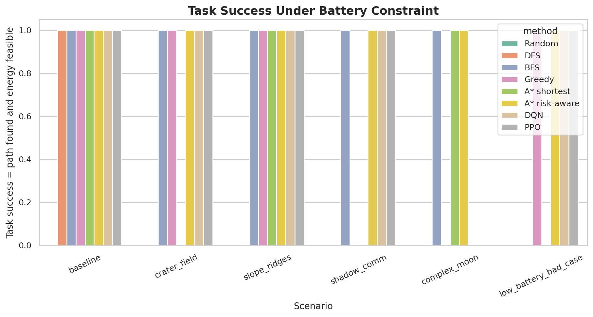
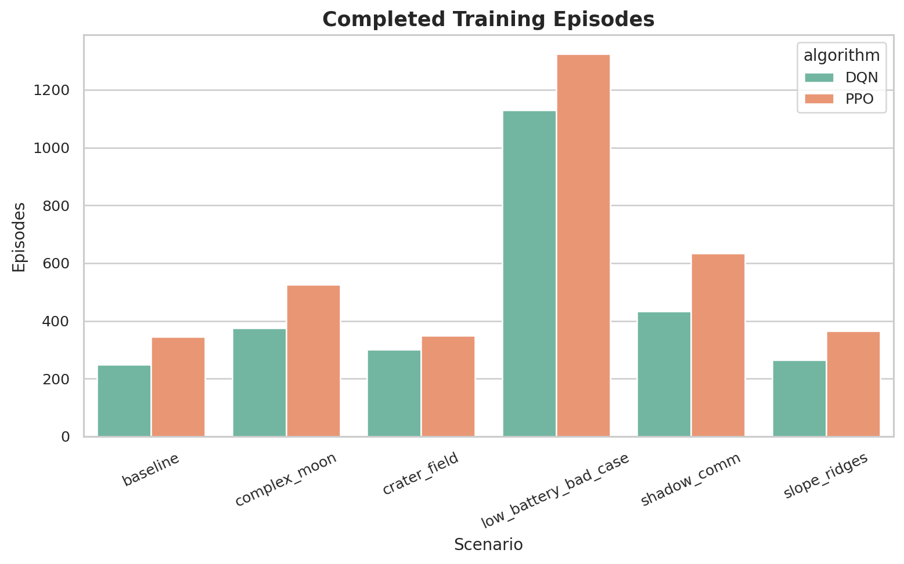

# Lunar Industrial Path Planning Experiment Report

## 1. Objective

This project studies path planning for an autonomous transport rover in a lunar industrial base. The simulated terrain is designed to resemble a simplified lunar surface, including crater fields, rock obstacles, elevation variation, steep ridges, soft regolith, permanent shadow regions, illumination differences, and communication blind zones.

The experiment compares eight methods:

- **Random**: a stochastic baseline that samples feasible moves.
- **DFS**: depth-first search, a blind graph-search baseline that can produce long and energy-inefficient routes.
- **BFS**: breadth-first search, an unweighted graph-search baseline that minimizes the number of grid steps but ignores terrain energy.
- **Greedy**: a local best-first baseline using distance-to-goal and terrain cost.
- **A\* shortest**: a geometric shortest-path baseline using distance and impassable obstacles.
- **A\* risk-aware**: a cost-aware A\* planner using slope, crater risk, regolith, illumination, and communication quality.
- **DQN**: a deep Q-network reinforcement learning agent trained with Stable-Baselines3.
- **PPO**: a policy-gradient reinforcement learning agent trained with Stable-Baselines3.

DQN and PPO are evaluated with a lightweight safety executor: invalid moves, repeated cells, and immediately battery-depleting moves are rejected during rollout. This does not provide a global path solution to the RL agents; it only enforces rover safety constraints during execution.

## 2. Inputs and Outputs

### Inputs

- Map size: `45 x 45` grid cells.
- Start: lunar base core area.
- Goal: resource extraction site or industrial target facility.
- Terrain layers: elevation, slope, obstacles, crater risk, soft regolith, illumination, and communication coverage.
- Action space: 8 movement directions, including cardinal and diagonal moves.
- RL reward: terminal reward for reaching the goal, terrain-dependent transition cost, invalid-move penalty, and potential-based distance shaping.
- Fairness control: all methods use the same map, start, goal, action directions, obstacle constraints, and evaluation metrics. The RL base reward uses the same transition cost optimized by risk-aware A\*; distance shaping is potential-based and is used only to accelerate training.
- Battery constraint: a route is counted as a full task success only if a path is found and its estimated energy consumption does not exceed the scenario battery capacity.

### Outputs

- Lunar environment visualization for each scenario.
- Path comparison visualization for each scenario.
- Deep RL training reward curves.
- Completed training episode chart.
- Cross-method metric comparison chart.
- Normalized metric heatmap.
- Battery feasibility and energy margin charts.
- Saved DQN/PPO model weights for each scenario.
- Raw metric CSV file.

## 3. Lunar Simulation Environment

### 3.1 Mapping Assumption

This experiment assumes a **fully known offline lunar terrain map**. Before planning starts, the rover is assumed to have access to the complete simulated DEM-derived environment, including elevation, slope, obstacle locations, crater risk, regolith, illumination, communication coverage, and battery capacity.

This means the current work is an offline path-planning study, not an online SLAM or exploration problem. Online perception, localization uncertainty, incremental mapping, dynamic obstacle discovery, and real-time map updates are outside the scope of this experiment.

The planning problem can therefore be stated as:

> Given a known lunar terrain map with DEM-derived slope, terrain risk, illumination, communication coverage, and battery constraints, plan an energy-feasible and risk-aware path for a lunar industrial rover.

### 3.2 Terrain Layers

| Variable | Meaning | Planning effect |
|---|---|---|
| elevation | Terrain height | Creates lunar ridges and depressions |
| slope | Local slope | Higher slope increases energy use and risk; extreme slope is impassable |
| obstacle | Rock or crater core | Impassable cell |
| crater_risk | Crater rim risk | Adds terrain hazard cost |
| regolith | Soft regolith level | Adds energy cost and traction risk |
| illumination | Sunlight intensity | Low illumination increases energy and thermal risk |
| communication | Communication quality | Poor coverage increases mission risk |

The map also stores a cell-level terrain score for visualization and local greedy scoring:

```text
Cost = 1
     + 2.8 * slope
     + 2.2 * crater_risk
     + 1.7 * regolith
     + 1.6 * (1 - illumination)
     + 1.3 * (1 - communication)
```

Energy is explicitly modeled at the transition level. Moving across different terrain consumes different energy. For a movement from cell `s` to next cell `s'`, the energy model is:

```text
transition_energy = move_distance
                  * (1
                     + 2.2 * slope(s')
                     + 1.7 * regolith(s')
                     + 1.1 * uphill_elevation_gain
                     + 0.8 * (1 - illumination(s')))
```

The total mission transition cost used by risk-aware A\* and the RL base reward is:

```text
transition_cost = transition_energy
                + 2.2 * crater_risk(s')
                + 1.0 * slope(s')
                + 1.3 * (1 - communication(s'))
RL_base_reward = -transition_cost
```

During execution, energy is accumulated after every movement. If cumulative energy exceeds `battery_capacity`, the route immediately fails and the executed trajectory stops at the depletion point. This applies to Random, Greedy, A\*, DQN, and PPO rollouts.

## 4. Experimental Scenarios

### baseline: Base Plain With Sparse Rocks

- Crater count: 4
- Rock density: 0.018
- Soft regolith patches: 2
- Shadow patches: 1
- Communication stations: 2
- Elevation variation scale: 1.0
- RL training timesteps per deep RL method: 50000
- Battery capacity: 90.0


### crater_field: Dense Crater Field

- Crater count: 10
- Rock density: 0.018
- Soft regolith patches: 2
- Shadow patches: 1
- Communication stations: 2
- Elevation variation scale: 1.0
- RL training timesteps per deep RL method: 60000
- Battery capacity: 90.0


### slope_ridges: Highland Ridges And Slopes

- Crater count: 6
- Rock density: 0.014
- Soft regolith patches: 2
- Shadow patches: 1
- Communication stations: 1
- Elevation variation scale: 2.2
- RL training timesteps per deep RL method: 60000
- Battery capacity: 92.0


### shadow_comm: Polar Shadow And Communication Gaps

- Crater count: 6
- Rock density: 0.014
- Soft regolith patches: 3
- Shadow patches: 5
- Communication stations: 1
- Elevation variation scale: 1.35
- RL training timesteps per deep RL method: 70000
- Battery capacity: 118.0


### complex_moon: Integrated Lunar Industrial Terrain

- Crater count: 9
- Rock density: 0.022
- Soft regolith patches: 5
- Shadow patches: 4
- Communication stations: 2
- Elevation variation scale: 1.8
- RL training timesteps per deep RL method: 80000
- Battery capacity: 108.0


### low_battery_bad_case: Low Battery Bad Case

- Crater count: 7
- Rock density: 0.016
- Soft regolith patches: 5
- Shadow patches: 4
- Communication stations: 1
- Elevation variation scale: 1.85
- RL training timesteps per deep RL method: 70000
- Battery capacity: 112.0


## 5. Visual Results

### 5.1 Metric Comparison


### 5.2 Normalized Metric Heatmap

Lower normalized values indicate better performance for the corresponding metric.


### 5.3 Battery Constraint Results




### 5.4 Deep RL Training Curves




## 6. Result Summary

### 6.1 Raw Metric Table

| scenario             | scenario_title                      | method        | path_found | energy_feasible | task_success | battery_capacity | energy_margin | path_length | total_cost | energy   | terrain_risk | shadow_ratio | comm_blackout_ratio | avg_slope |
| -------------------- | ----------------------------------- | ------------- | ---------- | --------------- | ------------ | ---------------- | ------------- | ----------- | ---------- | -------- | ------------ | ------------ | ------------------- | --------- |
| baseline             | Base Plain With Sparse Rocks        | Random        | 0          | 0               | 0            | 90.0             | -2.2711       | 70.7401     | 125.9971   | 92.2711  | 7.3149       | 0.0          | 0.1071              | 0.1306    |
| baseline             | Base Plain With Sparse Rocks        | DFS           | 1          | 1               | 1            | 90.0             | 6.9842        | 50.4975     | 145.2054   | 83.0158  | 17.511       | 0.0          | 0.5946              | 0.2206    |
| baseline             | Base Plain With Sparse Rocks        | BFS           | 1          | 1               | 1            | 90.0             | 5.1806        | 50.4975     | 149.028    | 84.8194  | 19.1812      | 0.0          | 0.5676              | 0.2427    |
| baseline             | Base Plain With Sparse Rocks        | Greedy        | 1          | 1               | 1            | 90.0             | 3.6603        | 54.598      | 135.8947   | 86.3397  | 8.8093       | 0.1364       | 0.6591              | 0.2002    |
| baseline             | Base Plain With Sparse Rocks        | A* shortest   | 1          | 1               | 1            | 90.0             | 6.9033        | 50.4975     | 145.3179   | 83.0967  | 17.5426      | 0.0          | 0.5946              | 0.2214    |
| baseline             | Base Plain With Sparse Rocks        | A* risk-aware | 1          | 1               | 1            | 90.0             | 11.4447       | 54.0122     | 122.078    | 78.5553  | 5.3423       | 0.1395       | 0.5814              | 0.1242    |
| baseline             | Base Plain With Sparse Rocks        | DQN           | 1          | 1               | 1            | 90.0             | 3.6603        | 54.598      | 135.8947   | 86.3397  | 8.8093       | 0.1364       | 0.6591              | 0.2002    |
| baseline             | Base Plain With Sparse Rocks        | PPO           | 1          | 1               | 1            | 90.0             | 3.6603        | 54.598      | 135.8947   | 86.3397  | 8.8093       | 0.1364       | 0.6591              | 0.2002    |
| crater_field         | Dense Crater Field                  | Random        | 0          | 0               | 0            | 90.0             | -0.2217       | 57.2843     | 212.5973   | 90.2217  | 33.3243      | 0.0          | 1.0                 | 0.2415    |
| crater_field         | Dense Crater Field                  | DFS           | 1          | 0               | 0            | 90.0             | -0.6078       | 51.669      | 171.9087   | 90.6078  | 19.8096      | 0.0769       | 1.0                 | 0.2464    |
| crater_field         | Dense Crater Field                  | BFS           | 1          | 1               | 1            | 90.0             | 1.8448        | 51.669      | 172.772    | 88.1552  | 21.0856      | 0.1282       | 1.0                 | 0.2355    |
| crater_field         | Dense Crater Field                  | Greedy        | 1          | 1               | 1            | 90.0             | 0.1916        | 54.0122     | 174.7711   | 89.8084  | 19.2915      | 0.0698       | 1.0                 | 0.2312    |
| crater_field         | Dense Crater Field                  | A* shortest   | 1          | 0               | 0            | 90.0             | -1.5696       | 51.669      | 173.1027   | 91.5696  | 20.0419      | 0.1026       | 1.0                 | 0.2524    |
| crater_field         | Dense Crater Field                  | A* risk-aware | 1          | 1               | 1            | 90.0             | 7.7549        | 52.2548     | 162.2758   | 82.2451  | 17.2395      | 0.075        | 1.0                 | 0.176     |
| crater_field         | Dense Crater Field                  | DQN           | 1          | 1               | 1            | 90.0             | 1.0062        | 54.0122     | 175.5805   | 88.9938  | 19.8954      | 0.0698       | 1.0                 | 0.2255    |
| crater_field         | Dense Crater Field                  | PPO           | 1          | 1               | 1            | 90.0             | 1.0062        | 54.0122     | 175.5805   | 88.9938  | 19.8954      | 0.0698       | 1.0                 | 0.2255    |
| slope_ridges         | Highland Ridges And Slopes          | Random        | 0          | 0               | 0            | 92.0             | -0.0774       | 61.6985     | 171.0319   | 92.0774  | 10.3792      | 0.0          | 1.0                 | 0.1922    |
| slope_ridges         | Highland Ridges And Slopes          | DFS           | 0          | 0               | 0            | 92.0             | -2.3697       | 52.0833     | 166.8879   | 94.3697  | 23.1072      | 0.0          | 0.5641              | 0.2874    |
| slope_ridges         | Highland Ridges And Slopes          | BFS           | 1          | 1               | 1            | 92.0             | 4.1972        | 51.669      | 146.8771   | 87.8028  | 16.4489      | 0.0513       | 0.6154              | 0.2474    |
| slope_ridges         | Highland Ridges And Slopes          | Greedy        | 1          | 1               | 1            | 92.0             | 3.9786        | 51.669      | 146.4494   | 88.0214  | 16.3189      | 0.0256       | 0.5641              | 0.2441    |
| slope_ridges         | Highland Ridges And Slopes          | A* shortest   | 1          | 1               | 1            | 92.0             | 1.1529        | 51.669      | 152.2413   | 90.8471  | 18.3421      | 0.0          | 0.5641              | 0.2742    |
| slope_ridges         | Highland Ridges And Slopes          | A* risk-aware | 1          | 1               | 1            | 92.0             | 6.0943        | 56.8406     | 132.1378   | 85.9057  | 6.2054       | 0.0          | 0.5333              | 0.1379    |
| slope_ridges         | Highland Ridges And Slopes          | DQN           | 1          | 1               | 1            | 92.0             | 3.6951        | 52.2548     | 149.2179   | 88.3049  | 17.4039      | 0.0          | 0.55                | 0.2438    |
| slope_ridges         | Highland Ridges And Slopes          | PPO           | 1          | 1               | 1            | 92.0             | 3.6951        | 52.2548     | 149.2179   | 88.3049  | 17.4039      | 0.0          | 0.55                | 0.2438    |
| shadow_comm          | Polar Shadow And Communication Gaps | Random        | 0          | 0               | 0            | 118.0            | -0.9916       | 61.5269     | 196.5224   | 118.9916 | 12.4257      | 0.0          | 0.9811              | 0.2344    |
| shadow_comm          | Polar Shadow And Communication Gaps | DFS           | 0          | 0               | 0            | 118.0            | -2.7583       | 46.4264     | 198.5494   | 120.7583 | 21.6666      | 0.1143       | 1.0                 | 0.3276    |
| shadow_comm          | Polar Shadow And Communication Gaps | BFS           | 1          | 1               | 1            | 118.0            | 2.5416        | 53.4264     | 202.4323   | 115.4584 | 22.7694      | 0.0          | 1.0                 | 0.3195    |
| shadow_comm          | Polar Shadow And Communication Gaps | Greedy        | 1          | 0               | 0            | 118.0            | -0.6167       | 55.4264     | 207.0917   | 118.6167 | 21.6706      | 0.0455       | 1.0                 | 0.28      |
| shadow_comm          | Polar Shadow And Communication Gaps | A* shortest   | 0          | 0               | 0            | 118.0            | -1.0258       | 46.598      | 193.9692   | 119.0258 | 19.5589      | 0.1111       | 1.0                 | 0.3072    |
| shadow_comm          | Polar Shadow And Communication Gaps | A* risk-aware | 1          | 1               | 1            | 118.0            | 25.3983       | 62.9411     | 158.9868   | 92.6017  | 9.3709       | 0.0          | 0.6667              | 0.1735    |
| shadow_comm          | Polar Shadow And Communication Gaps | DQN           | 1          | 1               | 1            | 118.0            | 0.2416        | 57.4264     | 208.1574   | 117.7584 | 20.9945      | 0.0435       | 1.0                 | 0.2531    |
| shadow_comm          | Polar Shadow And Communication Gaps | PPO           | 1          | 1               | 1            | 118.0            | 0.2416        | 57.4264     | 208.1574   | 117.7584 | 20.9945      | 0.0435       | 1.0                 | 0.2531    |
| complex_moon         | Integrated Lunar Industrial Terrain | Random        | 0          | 0               | 0            | 108.0            | -2.2688       | 63.9411     | 188.7639   | 110.2688 | 8.8625       | 0.0          | 1.0                 | 0.1611    |
| complex_moon         | Integrated Lunar Industrial Terrain | DFS           | 0          | 0               | 0            | 108.0            | -0.6132       | 52.598      | 201.4367   | 108.6132 | 24.4217      | 0.0          | 1.0                 | 0.2779    |
| complex_moon         | Integrated Lunar Industrial Terrain | BFS           | 1          | 1               | 1            | 108.0            | 2.9134        | 53.4264     | 198.0332   | 105.0866 | 24.044       | 0.0476       | 1.0                 | 0.2487    |
| complex_moon         | Integrated Lunar Industrial Terrain | Greedy        | 0          | 0               | 0            | 108.0            | -1.8891       | 53.0122     | 206.0971   | 109.8891 | 25.7662      | 0.0          | 1.0                 | 0.2694    |
| complex_moon         | Integrated Lunar Industrial Terrain | A* shortest   | 1          | 1               | 1            | 108.0            | 6.752         | 53.4264     | 192.433    | 101.248  | 23.8578      | 0.0476       | 1.0                 | 0.2847    |
| complex_moon         | Integrated Lunar Industrial Terrain | A* risk-aware | 1          | 1               | 1            | 108.0            | 7.9356        | 74.4558     | 173.5608   | 100.0644 | 8.3341       | 0.0          | 0.6029              | 0.1226    |
| complex_moon         | Integrated Lunar Industrial Terrain | DQN           | 0          | 1               | 0            | 108.0            | 0.8873        | 54.1838     | 206.5009   | 107.1127 | 26.3464      | 0.0          | 1.0                 | 0.2704    |
| complex_moon         | Integrated Lunar Industrial Terrain | PPO           | 0          | 1               | 0            | 108.0            | 0.8873        | 54.1838     | 206.5009   | 107.1127 | 26.3464      | 0.0          | 1.0                 | 0.2704    |
| low_battery_bad_case | Low Battery Bad Case                | Random        | 0          | 0               | 0            | 112.0            | -0.3309       | 73.8406     | 204.7828   | 112.3309 | 13.4574      | 0.0          | 1.0                 | 0.2171    |
| low_battery_bad_case | Low Battery Bad Case                | DFS           | 0          | 0               | 0            | 112.0            | -1.7844       | 48.0833     | 198.7867   | 113.7844 | 25.8079      | 0.0          | 1.0                 | 0.3731    |
| low_battery_bad_case | Low Battery Bad Case                | BFS           | 0          | 0               | 0            | 112.0            | -0.9581       | 47.669      | 199.8645   | 112.9581 | 26.6919      | 0.0          | 1.0                 | 0.3741    |
| low_battery_bad_case | Low Battery Bad Case                | Greedy        | 1          | 1               | 1            | 112.0            | 1.205         | 55.4264     | 175.5919   | 110.795  | 11.8579      | 0.0          | 1.0                 | 0.2695    |
| low_battery_bad_case | Low Battery Bad Case                | A* shortest   | 0          | 0               | 0            | 112.0            | -1.7844       | 48.0833     | 198.7867   | 113.7844 | 25.8079      | 0.0          | 1.0                 | 0.3731    |
| low_battery_bad_case | Low Battery Bad Case                | A* risk-aware | 1          | 1               | 1            | 112.0            | 33.2969       | 57.7696     | 141.6346   | 78.7031  | 7.0827       | 0.0          | 0.8958              | 0.1476    |
| low_battery_bad_case | Low Battery Bad Case                | DQN           | 1          | 1               | 1            | 112.0            | 1.205         | 55.4264     | 175.5919   | 110.795  | 11.8579      | 0.0          | 1.0                 | 0.2695    |
| low_battery_bad_case | Low Battery Bad Case                | PPO           | 1          | 1               | 1            | 112.0            | 1.205         | 55.4264     | 175.5919   | 110.795  | 11.8579      | 0.0          | 1.0                 | 0.2695    |

### 6.2 Lowest Total Cost Method per Scenario

| scenario             | method        | total_cost | path_length | energy   | terrain_risk |
| -------------------- | ------------- | ---------- | ----------- | -------- | ------------ |
| baseline             | A* risk-aware | 122.078    | 54.0122     | 78.5553  | 5.3423       |
| complex_moon         | A* risk-aware | 173.5608   | 74.4558     | 100.0644 | 8.3341       |
| crater_field         | A* risk-aware | 162.2758   | 52.2548     | 82.2451  | 17.2395      |
| low_battery_bad_case | A* risk-aware | 141.6346   | 57.7696     | 78.7031  | 7.0827       |
| shadow_comm          | A* risk-aware | 158.9868   | 62.9411     | 92.6017  | 9.3709       |
| slope_ridges         | A* risk-aware | 132.1378   | 56.8406     | 85.9057  | 6.2054       |

### 6.3 Lowest Energy Method per Scenario

| scenario             | method        | energy   | total_cost | path_length | terrain_risk |
| -------------------- | ------------- | -------- | ---------- | ----------- | ------------ |
| baseline             | A* risk-aware | 78.5553  | 122.078    | 54.0122     | 5.3423       |
| complex_moon         | A* risk-aware | 100.0644 | 173.5608   | 74.4558     | 8.3341       |
| crater_field         | A* risk-aware | 82.2451  | 162.2758   | 52.2548     | 17.2395      |
| low_battery_bad_case | A* risk-aware | 78.7031  | 141.6346   | 57.7696     | 7.0827       |
| shadow_comm          | A* risk-aware | 92.6017  | 158.9868   | 62.9411     | 9.3709       |
| slope_ridges         | A* risk-aware | 85.9057  | 132.1378   | 56.8406     | 6.2054       |

## 7. Analysis

1. **Random** is included only as a weak lower-bound baseline. It usually fails in dense crater or high-risk maps because it has no global objective.

2. **Greedy** improves over Random by moving toward the goal, but it is local and can get trapped near crater rims or obstacle pockets.

3. **DFS** and **BFS** are useful classical baselines. BFS can find a step-short path, while DFS may find a much longer route depending on search order. Neither method understands energy, illumination, communication, or crater risk during planning.

4. **A\* shortest** usually finds a short geometric route, but it may cross crater rims, steep slopes, shadow regions, or low-communication zones because it ignores mission risk.

5. **A\* risk-aware** explicitly models lunar terrain cost. It often selects a longer route, but the route is safer and more realistic for lunar industrial logistics.

6. **DQN** and **PPO** learn policies through environment interaction. They can produce feasible paths when reward shaping is sufficient, but their stability depends on training budget and scenario complexity. In the low-battery bad case, the neural policies avoid immediate battery depletion but still fail to reach the goal, which is an important negative result.

7. The battery capacities are intentionally tuned to create mixed outcomes rather than an all-pass or all-fail benchmark. In easier settings, several classical and RL methods can finish. In harder settings, methods fail for different reasons: blind search wastes energy, shortest-path search ignores terrain cost, greedy planning can be locally efficient but not globally safe, and RL policies may conserve energy without reaching the goal. A\* risk-aware is the only method designed to explicitly optimize the same energy-risk cost used by the evaluation, which explains its stronger pass rate.

8. Lunar path planning is not a normal shortest-path problem. After slope, illumination, communication, regolith, and battery capacity are introduced, the shortest path and the best mission path often differ.

## 8. Conclusion

The experiment demonstrates that moon-like terrain constraints change the path-planning objective. Distance-only planning is not enough for lunar industrial transportation. A risk-aware planner is a strong baseline for known static maps, while deep reinforcement learning becomes more relevant when future tasks include unknown terrain, dynamic hazards, multi-rover coordination, or long-horizon task scheduling.

## 9. Extra Experiment: RL Generalization to Unseen Maps

The main RL experiments train and evaluate DQN/PPO on the same scenario map. To test whether the learned policies generalize, an extra experiment evaluates the saved DQN/PPO models on unseen maps generated from the same scenario settings but with different random seeds. No additional training is performed.

### 9.1 Generalization Result Table


| train_scenario       | method         | train_seed | test_seed | path_found | energy_feasible | task_success | energy   | battery_capacity | energy_margin |
| -------------------- | -------------- | ---------- | --------- | ---------- | --------------- | ------------ | -------- | ---------------- | ------------- |
| baseline             | DQN unseen-map | 101        | 9101      | 1          | 1               | 1            | 89.0025  | 90.0             | 0.9975        |
| baseline             | PPO unseen-map | 101        | 9101      | 1          | 1               | 1            | 89.0025  | 90.0             | 0.9975        |
| crater_field         | DQN unseen-map | 202        | 9202      | 1          | 1               | 1            | 87.3412  | 90.0             | 2.6588        |
| crater_field         | PPO unseen-map | 202        | 9202      | 1          | 1               | 1            | 87.3412  | 90.0             | 2.6588        |
| slope_ridges         | DQN unseen-map | 303        | 9303      | 0          | 1               | 0            | 90.176   | 92.0             | 1.824         |
| slope_ridges         | PPO unseen-map | 303        | 9303      | 0          | 1               | 0            | 90.176   | 92.0             | 1.824         |
| shadow_comm          | DQN unseen-map | 404        | 9404      | 0          | 1               | 0            | 117.7826 | 118.0            | 0.2174        |
| shadow_comm          | PPO unseen-map | 404        | 9404      | 0          | 1               | 0            | 117.7826 | 118.0            | 0.2174        |
| complex_moon         | DQN unseen-map | 505        | 9505      | 1          | 1               | 1            | 96.609   | 108.0            | 11.391        |
| complex_moon         | PPO unseen-map | 505        | 9505      | 1          | 1               | 1            | 96.609   | 108.0            | 11.391        |
| low_battery_bad_case | DQN unseen-map | 606        | 9606      | 0          | 1               | 0            | 111.9061 | 112.0            | 0.0939        |
| low_battery_bad_case | PPO unseen-map | 606        | 9606      | 0          | 1               | 0            | 111.9061 | 112.0            | 0.0939        |

### 9.2 Generalization Summary

| method         | sum | count | pass_rate |
| -------------- | --- | ----- | --------- |
| DQN unseen-map | 3   | 6     | 0.5       |
| PPO unseen-map | 3   | 6     | 0.5       |

The result measures scenario-specific policy transfer to a new map seed. If pass rates are low, the conclusion is that the current DQN/PPO policies are not robust map-generalization planners; they mainly learn behavior for the map distribution seen during training.

## 10. Output Files

- Main runner: `scripts/run_lunar_path_experiments.py`
- Environment module: `lunar_path/environment.py`
- Method modules: `lunar_path/methods/`
- Metric CSV: `experiments/results/metrics.csv`
- RL generalization CSV: `experiments/results/generalization_metrics.csv`
- RL training logs: `experiments/results/rl_training_logs.csv`
- Saved RL weights: `experiments/results/models/`
- Figure directory: `experiments/results/figures/`
- Report file: `experiments/report.md`
